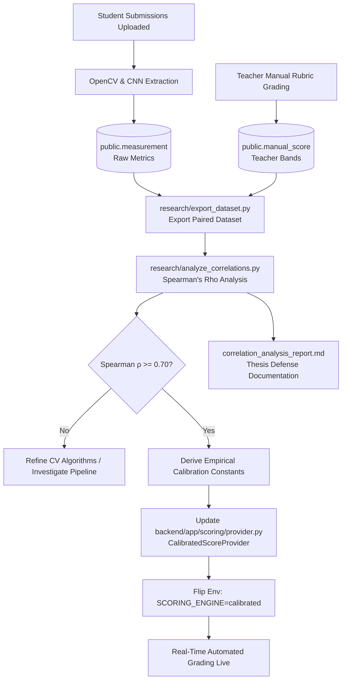

# WriteWise — Spearman's Rho Calibration & Scoring Integration Guide

This guide details how **Spearman's Rank Correlation Coefficient ($\rho$)** is analyzed from Phase 1 paired data, how empirical grading constants are derived, and how those results are integrated into WriteWise's automated scoring engine (`CalibratedScoreProvider`).

---

## 1. Executive Summary & Problem Context

WriteWise assesses Grade 3 cursive handwriting across five core criteria:
1. **Letter Formation** (CNN classification & regression)
2. **Size Consistency** (OpenCV guideline height ratio)
3. **Spacing** (OpenCV word & letter gap ratios)
4. **Slant** (OpenCV stroke orientation angle)
5. **Baseline Alignment** (OpenCV vertical deviation ratio)

### The Core Problem
Computer vision feature extraction produces physical, geometric measurements (angles in degrees, ratios, pixel distances). However, educational grading requires standardized rubric scores on a 0–100 scale (or 4 qualitative performance bands: *Needs Improvement*, *Developing*, *Satisfactory*, *Excellent*).

Arbitrary mathematical formulas cannot be guessed up-front. They must be **empirically calibrated** against human expert ground truth (elementary school teachers using standard cursive rubrics).

### Why Spearman's Rho ($\rho$) Instead of Pearson ($r$)?
Handwriting rubric scores are **ordinal** (discrete ranked bands: 1 to 4 or 12.5 to 87.5), not continuous intervals with normal distribution assumptions. Furthermore, human grading is monotonic rather than strictly linear. **Spearman's Rho ($\rho$)** evaluates whether rank order is preserved:
> *As geometric deviation increases, does the teacher's rubric score monotonically decrease?*

Per [PRD.md §11](file:///c:/Users/Admin/Documents/CODING%20PROJECTS/writewise/docs/PRD.md#L213), the project target is **$\rho \ge 0.70$ ($p < 0.05$)**, indicating strong, statistically validated agreement with human teacher evaluations.

---

## 2. End-to-End Workflow & Architecture



---

## 3. Data Collection (Phase 1)

In Phase 1:
- `SCORING_ENGINE=manual` ([ManualScoreProvider](file:///c:/Users/Admin/Documents/CODING%20PROJECTS/writewise/backend/app/scoring/provider.py#L127)). Score columns in `public.measurement` default to `NULL` at upload time.
- Teachers independently evaluate worksheets using a 4-band rubric:
  - **Needs Improvement** (internal anchor: 12.5)
  - **Developing** (internal anchor: 37.5)
  - **Satisfactory** (internal anchor: 62.5)
  - **Excellent** (internal anchor: 87.5)
- Records are saved in `public.manual_score` and paired with raw CV aggregates in `public.measurement`.

The export script [research/export_dataset.py](file:///c:/Users/Admin/Documents/CODING%20PROJECTS/writewise/research/export_dataset.py) compiles these into an anonymized research dataset (`research/output/paired_measurements.csv`).

---

## 4. Correlation Analysis & Threshold Derivation

The analysis script [research/analyze_correlations.py](file:///c:/Users/Admin/Documents/CODING%20PROJECTS/writewise/research/analyze_correlations.py) processes the paired records through two key mathematical routines:

### A. Spearman's Rank Correlation Formula
For sample size $n$ and rank difference $d_i = \text{rank}(x_i) - \text{rank}(y_i)$:
$$\rho = 1 - \frac{6 \sum_{i=1}^n d_i^2}{n(n^2 - 1)}$$

Ties are resolved using fractional ranking (average of shared rank positions). The two-tailed $p$-value is evaluated via Student's $t$-distribution approximation using the regularized incomplete beta function:
$$t = \rho \sqrt{\frac{n - 2}{1 - \rho^2}}$$

### B. Empirical Band Distribution Analysis
For each metric, summary statistics (mean, std, median, 25th percentile, 75th percentile) are computed across the four rubric bands.

The calibration constants are derived as follows:

| Criterion | Metric Key | Empirical Target Derivation | Empirical Penalty Derivation |
| :--- | :--- | :--- | :--- |
| **Slant** | `slant_mean` | `SLANT_TARGET_DEG` = Median of *Excellent* band | $\text{Penalty} = \frac{75.0}{\Delta \text{deviation}}$ between *Needs Improvement* and *Excellent* |
| **Word Spacing** | `word_spacing_mean` | `WORD_GAP_TARGET_RATIO` = Median of *Excellent* band | $\text{Penalty} = \frac{75.0}{\Delta \text{deviation}}$ across rubric bands |
| **Letter Spacing** | `letter_spacing_mean` | `LETTER_GAP_TARGET_RATIO` = Median of *Excellent* band | $\text{Penalty} = \frac{75.0}{\Delta \text{deviation}}$ across rubric bands |
| **Baseline Alignment**| `baseline_deviation_mean` | Ideal baseline deviation = $0.0$ | $\text{Penalty} = \frac{75.0}{\Delta \text{deviation}}$ relative to guideline height |
| **Size Consistency** | `size_consistency_mean` | `SIZE_RATIO_TARGET` = Median of *Excellent* band (ideal $\approx 1.0$) | $\text{Penalty} = \frac{75.0}{\Delta \text{deviation}}$ from target ratio |

*(Note: Score drop between Excellent [~87.5] and Needs Improvement [~12.5] is 75.0 points.)*

---

## 5. Live App Grading Integration (`CalibratedScoreProvider`)

Once constants are derived from the research script, they are updated in [backend/app/scoring/provider.py](file:///c:/Users/Admin/Documents/CODING%20PROJECTS/writewise/backend/app/scoring/provider.py):

```python
# Calibration baseline targets and penalty constants derived from Spearman analysis
SLANT_TARGET_DEG = 12.5  # Ideal forward cursive slant (~10°-15°)
SLANT_PENALTY_FACTOR = 2.5

WORD_GAP_TARGET_RATIO = 2.0  # Ideal word spacing relative to midline height
WORD_GAP_PENALTY_FACTOR = 35.0

LETTER_GAP_TARGET_RATIO = 0.4  # Ideal letter spacing relative to midline height
LETTER_GAP_PENALTY_FACTOR = 100.0

BASELINE_DEV_PENALTY_FACTOR = 350.0  # Deviation relative to guideline height

SIZE_RATIO_TARGET = 1.0  # Proportion matching expected 3-line guideline height
SIZE_DEV_PENALTY_FACTOR = 120.0
```

### Criterion Scoring Formulas
In `CalibratedScoreProvider.compute_scores(...)`:

1. **Slant Score:**
   $$\text{dev} = |\text{slant\_mean} - \text{SLANT\_TARGET\_DEG}|$$
   $$\text{score} = \text{clamp}(100.0 - \text{dev} \times \text{SLANT\_PENALTY\_FACTOR})$$

2. **Spacing Score (Blended Word & Letter Spacing):**
   $$\text{word\_score} = \text{clamp}(100.0 - |\text{word\_spacing} - \text{WORD\_GAP\_TARGET}| \times \text{WORD\_PENALTY})$$
   $$\text{letter\_score} = \text{clamp}(100.0 - |\text{letter\_spacing} - \text{LETTER\_GAP\_TARGET}| \times \text{LETTER\_PENALTY})$$
   $$\text{spacing\_score} = \text{clamp}(0.6 \times \text{word\_score} + 0.4 \times \text{letter\_score})$$

3. **Baseline Alignment Score:**
   $$\text{score} = \text{clamp}(100.0 - |\text{baseline\_dev\_mean}| \times \text{BASELINE\_DEV\_PENALTY\_FACTOR})$$

4. **Size Consistency Score:**
   $$\text{dev} = |\text{size\_mean} - \text{SIZE\_RATIO\_TARGET}|$$
   $$\text{score} = \text{clamp}(100.0 - \text{dev} \times \text{SIZE\_DEV\_PENALTY\_FACTOR})$$

5. **Letter Formation Score (CNN Passthrough):**
   $$\text{formation\_score} = \text{clamp}(\text{raw\_formation})$$
   *(The CNN Stage 2 regression head is trained directly against teacher scores, so output is already on the calibrated 0–100 scale; identity passthrough).*

6. **Composite Score:**
   Stored as an unweighted arithmetic mean across all 5 criteria (mirrored in Postgres generated column `composite_score` on `public.measurement`):
   $$\text{Composite Score} = \frac{\sum_{i=1}^5 \text{Criterion}_i}{5}$$

---

## 6. Activation & Production Deployment

1. **Verify Unit Tests**:
   ```bash
   cd backend
   uv run pytest tests/test_analyze_correlations.py tests/test_scoring.py
   ```
2. **Switch Backend Environment Variable**:
   In `.env` / Railway deployment config:
   ```env
   SCORING_ENGINE=calibrated
   ```
3. **Outcome**:
   - `create_submission` immediately calculates and writes calibrated 0–100 scores to `public.measurement` at upload time.
   - Diagnostic Command Deck, spatial attention overlays, teacher analytics, and parent progress tracking become fully live with real-time automated scores.
   - Manual rubric scoring fields are retired from the teacher portal.

---

## 7. Thesis Defense Deliverables

Running `analyze_correlations.py` produces:
* **`correlation_analysis_report.md`**: Formal Markdown report detailing sample size ($N$), Spearman's $\rho$, $p$-values, confidence intervals, and band distribution tables.
* **`correlation_analysis_results.json`**: Machine-readable statistical summary.

These artifacts provide the formal quantitative backing required for the BSIT Technical Defense (October 2026), proving that WriteWise's automated assessment engine satisfies the research success criteria outlined in [PRD.md §11](file:///c:/Users/Admin/Documents/CODING%20PROJECTS/writewise/docs/PRD.md#L213).
